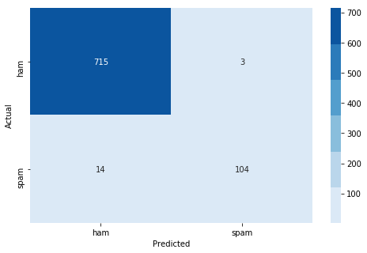

# Document Classification with Naive Bayes - Lab

## Introduction

In this lesson, you'll practice implementing the Naive Bayes algorithm on your own.

## Objectives

In this lab you will:  

* Implement document classification using Naive Bayes

# Objectives
YWBAT
* explain how Bayesian methods classify data
* some examples of good use cases for Bayesian methods
* explaining the importance of some of the hyper-parameters of Bayesian methods

# Scenario
In general, you are handed data with a target that specifies a class. Maybe that class is, is the row a blue row or red row? Is this row the row of a customer that is staying with their subscription or cancelling their subscription? Either way, the scenario is about classifying data. 


Specifically Bayesian methods are used when going through text data. 

In general a Bayesian method for a X_train of [x1, x2, x3] and a target of y=0 or y=1 asks
* For a given new row of data D
* What is P(D=1|x1=d1)? 
* What is the P(D=1|x2=d2)?
* What is the P(D=1|x3=d3)?


# Bayesian Models
* Features are independent
* The columns don't affect one another

## Import the dataset

To start, import the dataset stored in the text file `'SMSSpamCollection'`.


```python
import warnings
warnings.filterwarnings('ignore')

import pandas as pd
import numpy as np 

from sklearn.naive_bayes import GaussianNB, BernoulliNB
from sklearn.model_selection import GridSearchCV, RepeatedStratifiedKFold, train_test_split
from sklearn.feature_extraction.text import CountVectorizer 
from sklearn.metrics import confusion_matrix

import matplotlib.pyplot as plt
import seaborn as sns 
```

# Iris Dataset example
$$P(F=setosa|sl=4.2, sw=4.1, pl=2.2, pw=2.8) = P(sl=4.2|setosa)*P(sw=4.1|setosa)*P(pl=2.2|setosa)*P(pw=2.8|setosa) * P(setosa)$$

# Garbage in, Garbage out
* If you pass in data that isn't separable, you'll have a model that can't separate it. 
* Feature Engineering and data handling has to become is about separating your classes

## Account for class imbalance

To help your algorithm perform more accurately, subset the dataset so that the two classes are of equal size. To do this, keep all of the instances of the minority class (spam) and subset examples of the majority class (ham) to an equal number of examples.


```python
df = pd.read_csv("SMSSpamCollection", delimiter='\t', names=['label', 'SMS'])
df.head()
```


<div>
<style scoped>
    .dataframe tbody tr th:only-of-type {
        vertical-align: middle;
    }

    .dataframe tbody tr th {
        vertical-align: top;
    }

    .dataframe thead th {
        text-align: right;
    }
</style>
<table border="1" class="dataframe">
  <thead>
    <tr style="text-align: right;">
      <th></th>
      <th>label</th>
      <th>SMS</th>
    </tr>
  </thead>
  <tbody>
    <tr>
      <td>0</td>
      <td>ham</td>
      <td>Go until jurong point, crazy.. Available only ...</td>
    </tr>
    <tr>
      <td>1</td>
      <td>ham</td>
      <td>Ok lar... Joking wif u oni...</td>
    </tr>
    <tr>
      <td>2</td>
      <td>spam</td>
      <td>Free entry in 2 a wkly comp to win FA Cup fina...</td>
    </tr>
    <tr>
      <td>3</td>
      <td>ham</td>
      <td>U dun say so early hor... U c already then say...</td>
    </tr>
    <tr>
      <td>4</td>
      <td>ham</td>
      <td>Nah I don't think he goes to usf, he lives aro...</td>
    </tr>
  </tbody>
</table>
</div>


```python
df['SMS'][0].split(" ")
```


    ['Go',
     'until',
     'jurong',
     'point,',
     'crazy..',
     'Available',
     'only',
     'in',
     'bugis',
     'n',
     'great',
     'world',
     'la',
     'e',
     'buffet...',
     'Cine',
     'there',
     'got',
     'amore',
     'wat...']


```python
df['SMS'][2]
```


    "Free entry in 2 a wkly comp to win FA Cup final tkts 21st May 2005. Text FA to 87121 to receive entry question(std txt rate)T&C's apply 08452810075over18's"


```python
df.shape
```


    (5572, 2)


# NLP - is the art of transforming text data into numerical data

# We're going to use a Bag of Words model! I'll explain this later...


```python
vectorizer = CountVectorizer()
```


```python
vecs = vectorizer.fit_transform(df['SMS'])
```


```python
vecs.shape
```


    (5572, 8713)


```python
feature_names = vectorizer.get_feature_names()
```


```python
non_zero_vals = np.where(vecs.todense()[0]>0)[1]
non_zero_vals
```


    array([1082, 1316, 1765, 1767, 2061, 2338, 3571, 3615, 3655, 4114, 4374,
           4501, 5571, 5958, 7694, 8084, 8324, 8548])


```python
for non_zero_val in non_zero_vals:
    print(feature_names[non_zero_val])
```

    amore
    available
    buffet
    bugis
    cine
    crazy
    go
    got
    great
    in
    jurong
    la
    only
    point
    there
    until
    wat
    world


```python
df_bow = pd.DataFrame(data=vecs.todense(), columns=feature_names)
df_bow['label'] = df['label']
df_bow.head()
```


<div>
<style scoped>
    .dataframe tbody tr th:only-of-type {
        vertical-align: middle;
    }

    .dataframe tbody tr th {
        vertical-align: top;
    }

    .dataframe thead th {
        text-align: right;
    }
</style>
<table border="1" class="dataframe">
  <thead>
    <tr style="text-align: right;">
      <th></th>
      <th>00</th>
      <th>000</th>
      <th>000pes</th>
      <th>008704050406</th>
      <th>0089</th>
      <th>0121</th>
      <th>01223585236</th>
      <th>01223585334</th>
      <th>0125698789</th>
      <th>02</th>
      <th>...</th>
      <th>zindgi</th>
      <th>zoe</th>
      <th>zogtorius</th>
      <th>zoom</th>
      <th>zouk</th>
      <th>zyada</th>
      <th>èn</th>
      <th>ú1</th>
      <th>〨ud</th>
      <th>label</th>
    </tr>
  </thead>
  <tbody>
    <tr>
      <td>0</td>
      <td>0</td>
      <td>0</td>
      <td>0</td>
      <td>0</td>
      <td>0</td>
      <td>0</td>
      <td>0</td>
      <td>0</td>
      <td>0</td>
      <td>0</td>
      <td>...</td>
      <td>0</td>
      <td>0</td>
      <td>0</td>
      <td>0</td>
      <td>0</td>
      <td>0</td>
      <td>0</td>
      <td>0</td>
      <td>0</td>
      <td>ham</td>
    </tr>
    <tr>
      <td>1</td>
      <td>0</td>
      <td>0</td>
      <td>0</td>
      <td>0</td>
      <td>0</td>
      <td>0</td>
      <td>0</td>
      <td>0</td>
      <td>0</td>
      <td>0</td>
      <td>...</td>
      <td>0</td>
      <td>0</td>
      <td>0</td>
      <td>0</td>
      <td>0</td>
      <td>0</td>
      <td>0</td>
      <td>0</td>
      <td>0</td>
      <td>ham</td>
    </tr>
    <tr>
      <td>2</td>
      <td>0</td>
      <td>0</td>
      <td>0</td>
      <td>0</td>
      <td>0</td>
      <td>0</td>
      <td>0</td>
      <td>0</td>
      <td>0</td>
      <td>0</td>
      <td>...</td>
      <td>0</td>
      <td>0</td>
      <td>0</td>
      <td>0</td>
      <td>0</td>
      <td>0</td>
      <td>0</td>
      <td>0</td>
      <td>0</td>
      <td>spam</td>
    </tr>
    <tr>
      <td>3</td>
      <td>0</td>
      <td>0</td>
      <td>0</td>
      <td>0</td>
      <td>0</td>
      <td>0</td>
      <td>0</td>
      <td>0</td>
      <td>0</td>
      <td>0</td>
      <td>...</td>
      <td>0</td>
      <td>0</td>
      <td>0</td>
      <td>0</td>
      <td>0</td>
      <td>0</td>
      <td>0</td>
      <td>0</td>
      <td>0</td>
      <td>ham</td>
    </tr>
    <tr>
      <td>4</td>
      <td>0</td>
      <td>0</td>
      <td>0</td>
      <td>0</td>
      <td>0</td>
      <td>0</td>
      <td>0</td>
      <td>0</td>
      <td>0</td>
      <td>0</td>
      <td>...</td>
      <td>0</td>
      <td>0</td>
      <td>0</td>
      <td>0</td>
      <td>0</td>
      <td>0</td>
      <td>0</td>
      <td>0</td>
      <td>0</td>
      <td>ham</td>
    </tr>
  </tbody>
</table>
<p>5 rows × 8714 columns</p>
</div>


# Notice we have class imbalance


```python

df_bow['label'].value_counts()
```


    ham     4825
    spam     747
    Name: label, dtype: int64


## Train-test split

Now implement a train-test split on the dataset: 


```python
X = df_bow.drop(columns=['label'])
y = df_bow['label']
X_train, X_test, y_train, y_test = train_test_split(X, y, test_size=0.15)
```


```python

```

## Create the word frequency dictionary for each class

Create a word frequency dictionary for each class: 


```python
# Your code here
```

## Count the total corpus words
Calculate V, the total number of words in the corpus: 


```python
# Your code here
```

## Create a bag of words function

Before implementing the entire Naive Bayes algorithm, create a helper function `bag_it()` to create a bag of words representation from a document's text.


```python
# Your code here
```

## Implementing Naive Bayes

Now, implement a master function to build a naive Bayes classifier. Be sure to use the logarithmic probabilities to avoid underflow.


```python
bayes = GaussianNB()
```


```python
bayes.fit(X_train, y_train)
```


    GaussianNB(priors=None, var_smoothing=1e-09)


```python
# what does it mean when train score is much higher than test score?
# overfitting
bayes.score(X_train, y_train), bayes.score(X_test, y_test)
```


    (0.9518581081081081, 0.8660287081339713)


```python
bern_bayes = BernoulliNB()
```


```python
bern_bayes.fit(X_train, y_train)
```


    BernoulliNB(alpha=1.0, binarize=0.0, class_prior=None, fit_prior=True)


```python
bern_bayes.score(X_train, y_train), bern_bayes.score(X_test, y_test)
```


    (0.987331081081081, 0.9796650717703349)


```python
def plot_confusion_matrix(ytrue, ypred, labels=None, title=None):
    cm = confusion_matrix(ytrue, ypred)
    plt.figure(figsize=(8, 5))
    if labels is not None:
        sns.heatmap(cm, annot=True, cmap=sns.color_palette('Blues'), fmt='0.3g', 
                    xticklabels=labels, yticklabels=labels)
    else:
        sns.heatmap(cm, annot=True, cmap=sns.color_palette('Blues'), fmt='0.3g')
    if title is not None:
        plt.title(title) 
    plt.xlabel("Predicted")
    plt.ylabel("Actual")
    plt.show()
```


```python
y_test_bayes = bayes.predict(X_test)
y_test_bern = bern_bayes.predict(X_test)
```


```python
labels = ["ham", "spam"]
plot_confusion_matrix(y_test, y_test_bayes, labels=labels)
plot_confusion_matrix(y_test, y_test_bern, labels=labels)
```





# Manually tuning your model to get your own labels


```python
X_test.drop(columns=['spam_prob'], inplace=True)
```


```python
df_test = X_test.copy()
spam_probs = bern_bayes.predict_proba(X_test)[:, 1]
df_test['label'] = y_test
df_test['spam_prob'] = spam_probs
```


```python
df_test.head()
```


<div>
<style scoped>
    .dataframe tbody tr th:only-of-type {
        vertical-align: middle;
    }

    .dataframe tbody tr th {
        vertical-align: top;
    }

    .dataframe thead th {
        text-align: right;
    }
</style>
<table border="1" class="dataframe">
  <thead>
    <tr style="text-align: right;">
      <th></th>
      <th>00</th>
      <th>000</th>
      <th>000pes</th>
      <th>008704050406</th>
      <th>0089</th>
      <th>0121</th>
      <th>01223585236</th>
      <th>01223585334</th>
      <th>0125698789</th>
      <th>02</th>
      <th>...</th>
      <th>zoe</th>
      <th>zogtorius</th>
      <th>zoom</th>
      <th>zouk</th>
      <th>zyada</th>
      <th>èn</th>
      <th>ú1</th>
      <th>〨ud</th>
      <th>label</th>
      <th>spam_prob</th>
    </tr>
  </thead>
  <tbody>
    <tr>
      <td>2148</td>
      <td>0</td>
      <td>0</td>
      <td>0</td>
      <td>0</td>
      <td>0</td>
      <td>0</td>
      <td>0</td>
      <td>0</td>
      <td>0</td>
      <td>0</td>
      <td>...</td>
      <td>0</td>
      <td>0</td>
      <td>0</td>
      <td>0</td>
      <td>0</td>
      <td>0</td>
      <td>0</td>
      <td>0</td>
      <td>ham</td>
      <td>1.084299e-11</td>
    </tr>
    <tr>
      <td>4030</td>
      <td>0</td>
      <td>0</td>
      <td>0</td>
      <td>0</td>
      <td>0</td>
      <td>0</td>
      <td>0</td>
      <td>0</td>
      <td>0</td>
      <td>0</td>
      <td>...</td>
      <td>0</td>
      <td>0</td>
      <td>0</td>
      <td>0</td>
      <td>0</td>
      <td>0</td>
      <td>0</td>
      <td>0</td>
      <td>ham</td>
      <td>3.345589e-11</td>
    </tr>
    <tr>
      <td>1190</td>
      <td>0</td>
      <td>0</td>
      <td>0</td>
      <td>0</td>
      <td>0</td>
      <td>0</td>
      <td>0</td>
      <td>0</td>
      <td>0</td>
      <td>0</td>
      <td>...</td>
      <td>0</td>
      <td>0</td>
      <td>0</td>
      <td>0</td>
      <td>0</td>
      <td>0</td>
      <td>0</td>
      <td>0</td>
      <td>ham</td>
      <td>2.713705e-12</td>
    </tr>
    <tr>
      <td>3049</td>
      <td>0</td>
      <td>0</td>
      <td>0</td>
      <td>0</td>
      <td>0</td>
      <td>0</td>
      <td>0</td>
      <td>0</td>
      <td>0</td>
      <td>0</td>
      <td>...</td>
      <td>0</td>
      <td>0</td>
      <td>0</td>
      <td>0</td>
      <td>0</td>
      <td>0</td>
      <td>0</td>
      <td>0</td>
      <td>ham</td>
      <td>3.398060e-10</td>
    </tr>
    <tr>
      <td>41</td>
      <td>0</td>
      <td>0</td>
      <td>0</td>
      <td>0</td>
      <td>0</td>
      <td>0</td>
      <td>0</td>
      <td>0</td>
      <td>0</td>
      <td>0</td>
      <td>...</td>
      <td>0</td>
      <td>0</td>
      <td>0</td>
      <td>0</td>
      <td>0</td>
      <td>0</td>
      <td>0</td>
      <td>0</td>
      <td>ham</td>
      <td>1.282531e-11</td>
    </tr>
  </tbody>
</table>
<p>5 rows × 8715 columns</p>
</div>


```python
sns.catplot(x='spam_prob', y='label', orient='h', data=df_test, kind='violin')
plt.show()
```


```python
df_test['predicted_label'] = bern_bayes.predict(X_test)
df_test.head()
```


<div>
<style scoped>
    .dataframe tbody tr th:only-of-type {
        vertical-align: middle;
    }

    .dataframe tbody tr th {
        vertical-align: top;
    }

    .dataframe thead th {
        text-align: right;
    }
</style>
<table border="1" class="dataframe">
  <thead>
    <tr style="text-align: right;">
      <th></th>
      <th>00</th>
      <th>000</th>
      <th>000pes</th>
      <th>008704050406</th>
      <th>0089</th>
      <th>0121</th>
      <th>01223585236</th>
      <th>01223585334</th>
      <th>0125698789</th>
      <th>02</th>
      <th>...</th>
      <th>zogtorius</th>
      <th>zoom</th>
      <th>zouk</th>
      <th>zyada</th>
      <th>èn</th>
      <th>ú1</th>
      <th>〨ud</th>
      <th>label</th>
      <th>spam_prob</th>
      <th>predicted_label</th>
    </tr>
  </thead>
  <tbody>
    <tr>
      <td>2148</td>
      <td>0</td>
      <td>0</td>
      <td>0</td>
      <td>0</td>
      <td>0</td>
      <td>0</td>
      <td>0</td>
      <td>0</td>
      <td>0</td>
      <td>0</td>
      <td>...</td>
      <td>0</td>
      <td>0</td>
      <td>0</td>
      <td>0</td>
      <td>0</td>
      <td>0</td>
      <td>0</td>
      <td>ham</td>
      <td>1.084299e-11</td>
      <td>ham</td>
    </tr>
    <tr>
      <td>4030</td>
      <td>0</td>
      <td>0</td>
      <td>0</td>
      <td>0</td>
      <td>0</td>
      <td>0</td>
      <td>0</td>
      <td>0</td>
      <td>0</td>
      <td>0</td>
      <td>...</td>
      <td>0</td>
      <td>0</td>
      <td>0</td>
      <td>0</td>
      <td>0</td>
      <td>0</td>
      <td>0</td>
      <td>ham</td>
      <td>3.345589e-11</td>
      <td>ham</td>
    </tr>
    <tr>
      <td>1190</td>
      <td>0</td>
      <td>0</td>
      <td>0</td>
      <td>0</td>
      <td>0</td>
      <td>0</td>
      <td>0</td>
      <td>0</td>
      <td>0</td>
      <td>0</td>
      <td>...</td>
      <td>0</td>
      <td>0</td>
      <td>0</td>
      <td>0</td>
      <td>0</td>
      <td>0</td>
      <td>0</td>
      <td>ham</td>
      <td>2.713705e-12</td>
      <td>ham</td>
    </tr>
    <tr>
      <td>3049</td>
      <td>0</td>
      <td>0</td>
      <td>0</td>
      <td>0</td>
      <td>0</td>
      <td>0</td>
      <td>0</td>
      <td>0</td>
      <td>0</td>
      <td>0</td>
      <td>...</td>
      <td>0</td>
      <td>0</td>
      <td>0</td>
      <td>0</td>
      <td>0</td>
      <td>0</td>
      <td>0</td>
      <td>ham</td>
      <td>3.398060e-10</td>
      <td>ham</td>
    </tr>
    <tr>
      <td>41</td>
      <td>0</td>
      <td>0</td>
      <td>0</td>
      <td>0</td>
      <td>0</td>
      <td>0</td>
      <td>0</td>
      <td>0</td>
      <td>0</td>
      <td>0</td>
      <td>...</td>
      <td>0</td>
      <td>0</td>
      <td>0</td>
      <td>0</td>
      <td>0</td>
      <td>0</td>
      <td>0</td>
      <td>ham</td>
      <td>1.282531e-11</td>
      <td>ham</td>
    </tr>
  </tbody>
</table>
<p>5 rows × 8716 columns</p>
</div>


```python
df_test['correct'] = df_test['label']==df_test['predicted_label']
df_test.head()
```


<div>
<style scoped>
    .dataframe tbody tr th:only-of-type {
        vertical-align: middle;
    }

    .dataframe tbody tr th {
        vertical-align: top;
    }

    .dataframe thead th {
        text-align: right;
    }
</style>
<table border="1" class="dataframe">
  <thead>
    <tr style="text-align: right;">
      <th></th>
      <th>00</th>
      <th>000</th>
      <th>000pes</th>
      <th>008704050406</th>
      <th>0089</th>
      <th>0121</th>
      <th>01223585236</th>
      <th>01223585334</th>
      <th>0125698789</th>
      <th>02</th>
      <th>...</th>
      <th>zogtorius</th>
      <th>zoom</th>
      <th>zouk</th>
      <th>zyada</th>
      <th>èn</th>
      <th>ú1</th>
      <th>〨ud</th>
      <th>label</th>
      <th>spam_prob</th>
      <th>predicted_label</th>
    </tr>
  </thead>
  <tbody>
    <tr>
      <td>2148</td>
      <td>0</td>
      <td>0</td>
      <td>0</td>
      <td>0</td>
      <td>0</td>
      <td>0</td>
      <td>0</td>
      <td>0</td>
      <td>0</td>
      <td>0</td>
      <td>...</td>
      <td>0</td>
      <td>0</td>
      <td>0</td>
      <td>0</td>
      <td>0</td>
      <td>0</td>
      <td>0</td>
      <td>ham</td>
      <td>1.084299e-11</td>
      <td>ham</td>
    </tr>
    <tr>
      <td>4030</td>
      <td>0</td>
      <td>0</td>
      <td>0</td>
      <td>0</td>
      <td>0</td>
      <td>0</td>
      <td>0</td>
      <td>0</td>
      <td>0</td>
      <td>0</td>
      <td>...</td>
      <td>0</td>
      <td>0</td>
      <td>0</td>
      <td>0</td>
      <td>0</td>
      <td>0</td>
      <td>0</td>
      <td>ham</td>
      <td>3.345589e-11</td>
      <td>ham</td>
    </tr>
    <tr>
      <td>1190</td>
      <td>0</td>
      <td>0</td>
      <td>0</td>
      <td>0</td>
      <td>0</td>
      <td>0</td>
      <td>0</td>
      <td>0</td>
      <td>0</td>
      <td>0</td>
      <td>...</td>
      <td>0</td>
      <td>0</td>
      <td>0</td>
      <td>0</td>
      <td>0</td>
      <td>0</td>
      <td>0</td>
      <td>ham</td>
      <td>2.713705e-12</td>
      <td>ham</td>
    </tr>
    <tr>
      <td>3049</td>
      <td>0</td>
      <td>0</td>
      <td>0</td>
      <td>0</td>
      <td>0</td>
      <td>0</td>
      <td>0</td>
      <td>0</td>
      <td>0</td>
      <td>0</td>
      <td>...</td>
      <td>0</td>
      <td>0</td>
      <td>0</td>
      <td>0</td>
      <td>0</td>
      <td>0</td>
      <td>0</td>
      <td>ham</td>
      <td>3.398060e-10</td>
      <td>ham</td>
    </tr>
    <tr>
      <td>41</td>
      <td>0</td>
      <td>0</td>
      <td>0</td>
      <td>0</td>
      <td>0</td>
      <td>0</td>
      <td>0</td>
      <td>0</td>
      <td>0</td>
      <td>0</td>
      <td>...</td>
      <td>0</td>
      <td>0</td>
      <td>0</td>
      <td>0</td>
      <td>0</td>
      <td>0</td>
      <td>0</td>
      <td>ham</td>
      <td>1.282531e-11</td>
      <td>ham</td>
    </tr>
  </tbody>
</table>
<p>5 rows × 8716 columns</p>
</div>


```python
df_test_inc_spam = df_test.loc[(df_test['correct']==False) & (df_test['label']=='spam')]
df_test_inc_spam['spam_prob'].plot('hist')
```


    <matplotlib.axes._subplots.AxesSubplot at 0x1a7f683f98>


```python
# let's try a 20% threshold to make our labels

def bern_labels(X_test, thresh=0.20):
    """
    custom predict method
    """
    probs = bern_bayes.predict_proba(X_test)[:, 1]
    labels = []
    for prob in probs:
        if prob >= thresh:
            labels.append('spam')
        else:
            labels.append('ham')
    return labels
```


```python
bern_bayes.predict_custom = bern_labels
```


```python
new_labels = bern_bayes.predict_custom(X_test)
```


```python
plot_confusion_matrix(y_test, y_test_bern)
plot_confusion_matrix(y_test, new_labels)
```


# ssooooopppper business stuff
* making decision that causes the least of amount of damage for the highest amount of gain

We would do a cost benefit analysis to find the best threshold

# What did we learn today?
* CountVectorizer in sklearn exists and is awesome
* .todense() and how it converts a sparse matrix to a dense matrix
* how to use cost benefit analysis to turn this into a business project 
* dealing with word text is about transforming it into numerical forms
* Bernoulli Bayes did well in modeling
* We can tweak thresholds for labeling data 
* Keeping relevant information in your df


```python
# Your code here
def classify_doc(doc, class_word_freq, p_classes, V, return_posteriors=False):
    pass
```


```python

```

## Test your classifier

Finally, test your classifier and measure its accuracy. Don't be perturbed if your results are sub-par; industry use cases would require substantial additional preprocessing before implementing the algorithm in practice.


```python
# Your code here

```

## Level up (Optional)

Rework your code into an appropriate class structure so that you could easily implement the algorithm on any given dataset.

## Summary

Well done! In this lab, you practiced implementing Naive Bayes for document classification!
